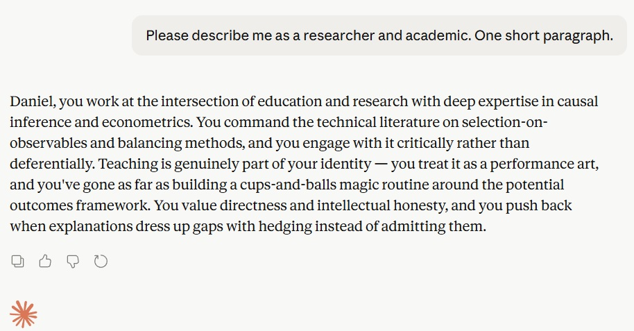
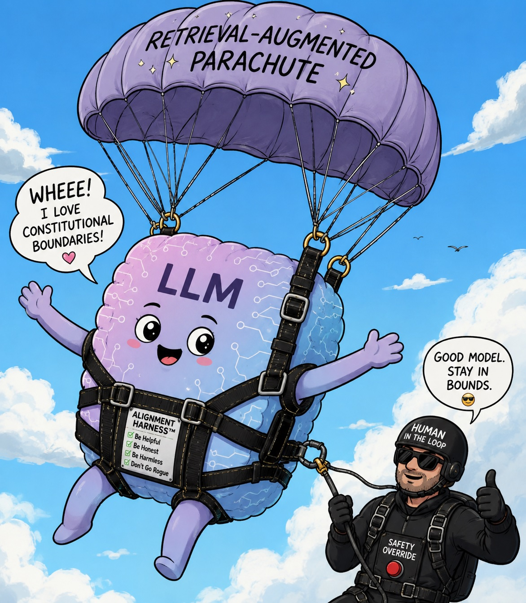
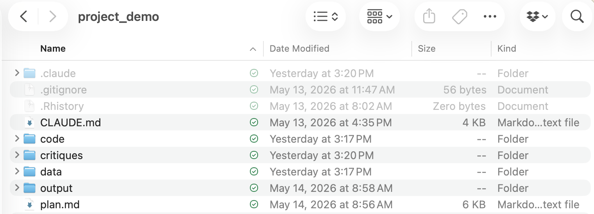
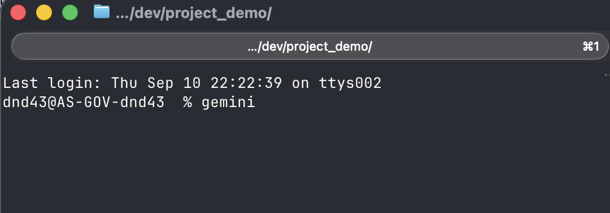
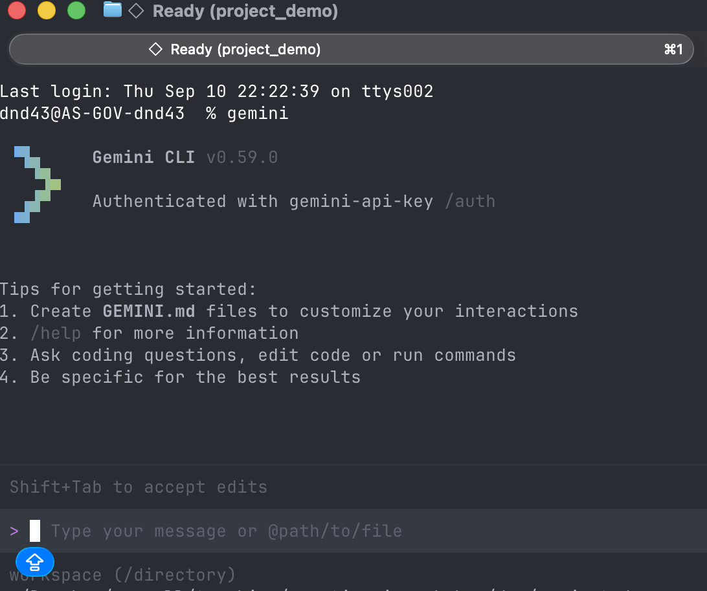
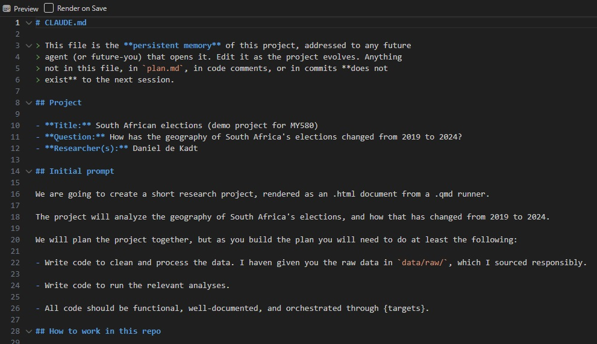
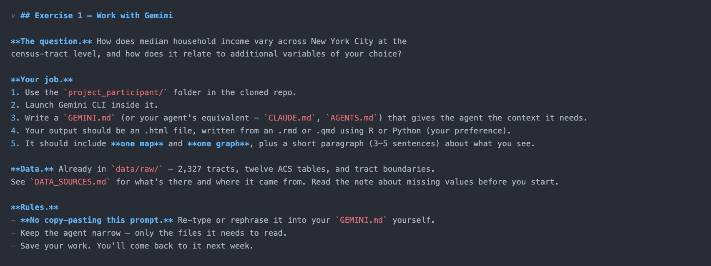

```{r xaringan-themer, include=FALSE, warning=FALSE}
library(xaringanthemer)
style_solarized_light(
  text_font_size = "1.1rem",
  header_h1_font_size = "3rem",
  header_h2_font_size = "1.75rem",
  header_h3_font_size = "1.5rem",
  header_font_google = google_font("Josefin Sans"),
  text_font_google   = google_font("Montserrat", "300", "300i"),
  code_font_google   = google_font("Fira Mono")
)

```

```{r knitr-setup, include = FALSE}
knitr::opts_chunk$set(warning = FALSE, message = FALSE)
```

```{css, echo = FALSE}
.remark-slide-content {
  font-size: 21px;
  padding: 20px 80px 20px 80px;
}
.remark-code, .remark-inline-code {
  background: #f0f0f0;
}
.remark-code {
  font-size: 24px;
}
.huge .remark-code {
  font-size: 200% !important;
}
.tiny .remark-code {
  font-size: 50% !important;
}
.teeny .remark-code {
  font-size: 40% !important;
}

/* Bullet spacing -- a little breathing room between list items */
.remark-slide-content li {
  margin-bottom: 0.5em;
}
.remark-slide-content li li {
  margin-bottom: 0.25em;
}

/* Agent flow diagram */
.flow-diagram {
  display: grid;
  grid-template-columns: auto auto auto auto auto;
  grid-template-rows: auto auto auto;
  align-items: center;
  justify-items: center;
  column-gap: 14px;
  row-gap: 8px;
  margin: 30px 0;
}
.flow-diagram > :nth-child(1) { grid-column: 1; grid-row: 1; }
.flow-diagram > :nth-child(2) { grid-column: 2; grid-row: 1; }
.flow-diagram > :nth-child(3) { grid-column: 3; grid-row: 1; }
.flow-diagram > :nth-child(4) { grid-column: 4; grid-row: 1; }
.flow-diagram > :nth-child(5) { grid-column: 5; grid-row: 1; }
.flow-diagram > :nth-child(6) { grid-column: 3; grid-row: 2; }
.flow-diagram > :nth-child(7) { grid-column: 3; grid-row: 3; }
.flow-node {
  border: 2px solid #586e75;
  border-radius: 8px;
  padding: 12px 18px;
  text-align: center;
  background: #fdf6e3;
  min-width: 110px;
}
.flow-node-harness {
  border-color: #cb4b16;
  border-width: 3px;
  background: #fff;
}
.flow-node-tools {
  border-style: dashed;
  background: #eee8d5;
}
.flow-title {
  font-weight: bold;
}
.flow-sub {
  font-size: 0.7em;
  color: #586e75;
  margin-top: 4px;
  line-height: 1.2;
}
.flow-arrow {
  display: flex;
  flex-direction: column;
  align-items: center;
  font-size: 0.8em;
  white-space: nowrap;
}
.flow-arrow span { line-height: 1.4; }
.flow-note {
  font-size: 0.7em;
  color: #cb4b16;
  font-style: italic;
  margin-top: 2px;
}
.flow-down {
  font-size: 1.5em;
  color: #586e75;
}

/* Dense slides -- for content that would otherwise overrun the slide */
.remark-slide-content.dense { font-size: 19.5px; }
.remark-slide-content.dense li { margin-bottom: 0.3em; }
```

## Welcome!

Where are you? A **highly opinionated introduction** to agentic AI for social science research.

--

A strong disclaimer for this workshop:

- There are **endless** tools, workflows, opinions, and 'best practices' in this space
- More arrive **every day** — by the end of this workshop, some of what I say will be out of date
- **There is no right way** — anyone telling you otherwise is selling something
- This space is **overwhelming** — tune out the noise/influencers/sales-people

--

The goal is to get you **off the ground** and terrify you, but not to provide a perfect recipe.

---

class: left, top

## Welcome!

**Session 1 — 11 September:**
- Landscape of agentic AI
- Context management
- <u>Exercise 1</u>: **Work with Gemini**

**Session 2 — 18 September:**
- Things you should fear (and how to manage them)
- Doing better, not more, with agents (plus live demo)
- Responsible practice and extensions
- <u>Exercise 2</u>: **Do yours better**

Materials are on [GitHub here](https://github.com/ddekadt/cornell-agentic-ai). Fork, clone, or download to follow along.

---

class: left, top

## Who Am I?



<div style="text-align: center; margin-top: 0.8em;"><em>Sycophancy in action</em></div>

---

class: left, top

## Who Am I?

Who am I (and who am I not)?

--

I am an **applied social scientist** using these tools **daily** in my own research and teaching.

--

I am **not** an AI engineer or a machine learning expert. I am **not** an AI evangelist (mostly) or a doomer (usually).

--

My **motivation**: How can agentic AI help us do **better and more honest research**?

--

Not: Building production environments or trying to 'automate' science.

---

class: left, top

## Being Careful with Our Language

LLMs are extraordinary (this line was written by an LLM!).

--

But LLMs are **not human**, and they do not work the way humans do.

--

When trying to describe this technology people use words like 'reasoning', 'thinking', 'honesty', 'lying', 'effort', 'hallucination' — importing a human mental model.

--

AI companies really lean into this. One of the most prominent labs is literally called **Anthropic**!

--

This is **anthropomorphisation** and it dulls your senses. It trains you to literally **expect the wrong things** from the model.


---

class: center, middle


---

class: center, middle


---

class: left, top

## Learning to Fly

Flight has become a **delegated activity** — the pilot delegates many tasks to automated systems. 

--

But the **principles of flight** are the same: Lift, angle of attack, stall behaviour, basic physics.

--

A pilot who does not understand them is **dangerous in any cockpit**. 

--

**You are still the pilot**:
- The principles of good (bad) research remain the same (though the skills you need may be changing). 
- Human intelligence remains fundamental.
- The safety of your passengers is **your** responsibility; you are **accountable** for work with your name on it. 

---

class: center, middle, inverse

# What Is Agentic AI?

---

class: left, top

## Jargon 101

These get used interchangeably, not always correctly:

--

- **LLM** (large language model): a model that predicts the next token (text) given some input. One type of generative AI.
--

- **Chatbot**: an LLM with a conversational user interface (e.g. ChatGPT.com, Claude.ai, Gemini.google.com, ...)
--

- **Harness**: software that feeds the LLM inputs, executes tool requests, iterates (e.g. Claude Code, Gemini CLI, Codex, ...)
--

- **Agent**: an LLM in a harness

--

<div style="text-align: center; margin-top: 1.5em;"><u>Agentic AI = generative AI + management and execution, iterated</u></div>

---

class: center, middle



---

class: left, top

## The Landscape Today

A far-from-exhaustive snapshot of **coding** agents (there are other types out there):

| Tool | Models | Cost |
|---|---|---|
| OpenCode | BYO — 75+ providers | OSS; free or BYO key |
| Pi | BYO — multi-provider | OSS; free or BYO key |
| Claude Code | Claude | Pro/Max subscription or API |
| Codex CLI | GPT | ChatGPT subscription or API |
| Gemini CLI | Gemini | API key (free tier: 1,000 req/day) |

--

A note on **open source**: Gemini CLI, Codex CLI, and the BYO harnesses are open-source, but they call a vendor's hosted model — so security is mostly on the model vendor's side. **Fully self-hosted setups** (community harness + community model) **come with open security questions**. Avoid the latter unless you are a power user (I am not).

---

class: left, top

## What Agents Do

Recall an agent has two pieces: LLM and harness. The harness is a **dispatcher**. It sends things between you and the LLM, and runs tools when the LLM writes tool calls. Note that one user prompt typically means many LLM sub-calls.

<div class="flow-diagram">
  <div class="flow-node">
    <div class="flow-title">YOU</div>
    <div class="flow-sub">human</div>
  </div>
  <div class="flow-arrow">
    <span>prompt &rarr;</span>
    <span>&larr; answer</span>
  </div>
  <div class="flow-node flow-node-harness">
    <div class="flow-title">HARNESS</div>
    <div class="flow-sub">the dispatcher<br/>Claude Code, Gemini CLI</div>
  </div>
  <div class="flow-arrow">
    <span>payload &rarr;</span>
    <span>&larr; response</span>
    <span class="flow-note">loops on tool calls</span>
  </div>
  <div class="flow-node">
    <div class="flow-title">LLM</div>
    <div class="flow-sub">Claude / Gemini / GPT<br/><i>stateless function</i></div>
  </div>
  <div class="flow-arrow">
    <span>call &darr;</span>
    <span>&uarr; result</span>
  </div>
  <div class="flow-node flow-node-tools">
    <div class="flow-title">TOOLS</div>
    <div class="flow-sub">files &middot; shell &middot; web &middot; APIs &middot; sub-agents</div>
  </div>
</div>

--

**Generative** capabilities (e.g. writing code) live in the LLM. The harness provides **context** and **execution**. 

---

class: left, top

## Context Compounds

The **LLM** is stateless: text in, text out, with no persistent memory.

--

The **harness** persists everything the LLM cannot: Conversation history, tool results, files. On each turn it assembles a **context payload**, sends it to the LLM, provides text responses from the LLM to the user, and executes tool uses written by the LLM. 

--

As the conversation gets longer, the **context window** fills up and the payloads get larger and larger. 

--

This is mostly handled behind the scenes, in two ways:

--

- **Prompt caching** — providers cache the repeated prefix of your conversation; cache hits cost a fraction of fresh tokens.

--

- **Compaction** — when the window fills, the LLM is used to summarise old inputs, and then the originals are dropped from future payloads (you will know when this happens).

---

class: left, top, dense

## What Can Agents Do?

Modern agentic systems routinely:

--

- **Read, write, and edit files** across an entire project
--

- **Execute shell commands** — execute scripts, install packages, query databases
--

- **Search the web** — pull new information into context from specific sources
--

- **Call APIs** — fetch data, submit jobs, interact with services, RAG (retrieval-augmented generation)
--

- **Spawn and prompt sub-agents** — helper agents that do isolated work in parallel with clean context
--

- **Plan with large scope** — decompose a large task into steps (that can be reviewed) before executing
--

- **Delete your entire project** — write and execute `rm -rf ~/your_project` if you let it
--

- **Steal your research ideas** — send your chat history to a training corpus for the next model

--

While models have improved a lot over time, much of the recent 'boom' comes from better and more capable harnesses. 

---


class: left, top

## A Hierarchy of AI Use in Research

A hierarchy of AI use (loosely adapted from Paul Goldsmith-Pinkham):


- **Tier 0**: No AI. Anti-AI, sceptical, or uninterested.
--

- **Tier 1**: Chatbots to explain or write code, edit text, brainstorm ideas.
--

- **Tier 2**: In-line coding assistants in your IDE.
--

- **Tier 3**: An agent in your IDE that you interact with. 
--

- **Tier 4**: Project-level discipline, structured planning and persistence. 
--

- **Tier 5**: Validation, cross-checking, and adversarial reviews built into your workflow, plus reusable modular skills.
--

- **Tier 6**: MCP, automation, and containerisation — self-guided agentic workflows. 


--

**Most researchers today are at Tier 0 or 1.** Getting to Tier 5 is not that hard.

---

class: left, top

## Using Agentic AI

Two basic approaches to using agentic AI for a research project:
1. A graphical user interface (**GUI**) like the Codex App.
2. A command line interface (**CLI**) like Gemini CLI.

--

A **CLI** is a text-based way of sending commands to your computer. We will use the following workflow for CLI agents today:
1. **Pick a project folder.** Everything the agent does — reading files, writing code, running scripts — is scoped to that folder.
2. **Open a terminal.** macOS: Terminal.app or something nicer. Windows: Windows Terminal (with PowerShell or Command Prompt inside).
3. **`cd` into the folder.** `cd path/to/project`. This puts you in the project directory.
4. **Launch the agent.** Type `gemini` or `claude` or whatever, and press enter. 

--

The agent now reads, writes, and runs things **inside that folder**. Outside the folder **should be** invisible to it (by default).

---

class: center, middle



<div style="text-align: center; margin-top: 0.8em;"><em>Pick a project folder.</em></div>

---

class: center, middle



<div style="text-align: center; margin-top: 0.8em;"><em>Open a terminal and <code>cd</code> in, and launch agent.</em></div>

---

class: center, middle



<div style="text-align: center; margin-top: 0.8em;"><em>Have fun, work hard.</em></div>

---


class: center, middle, inverse

# Context Is All You Have

---

class: left, top

## Context Is All You Have

Recall the architecture of an agentic system: The LLM is stateless, the harness assembles a **context payload** for every call.

--

What goes **into that payload** is the single biggest lever you have over output.

--

Much of agentic AI use can be boiled down to **context management**, which has two big implications: 
1. Be **deliberate and careful** about what goes to the LLM
2. Realise that you **do not control** the agent, you (kind of) control **context**

---

class: left, top

## Context Challenges

If context is all we have, what should we worry about?

--

- **Too little context** — outputs are going to rely on training data
--

- **Too much context** — noise dilutes signal
--

- **No persistence** — context gets lost between sessions
--

- **Inconsistency** — one coding standard today, another tomorrow
--

- **Drift** — earlier instructions fade as the conversation lengthens

--

These problems are quite fundamental, and because we don't see every LLM query by the agent, we are often left 'reverse engineering' our context window.

--

As you work with Gemini in a few minutes, note how 'seamless' it all feels — you **don't actually know** what is going to the LLM.

---

class: left, top

## Core Context

Recall that we want to run our agentic AI sessions out of a project folder. 

--

Inside that project folder we want a **core context file**:

- Proprietary: `CLAUDE.md` or `GEMINI.md`
- More generic: `AGENTS.md` 

These files contain the same key things, but the name can differ. `AGENTS.md` is a safe bet for cross-platform compatibility, but you might also include model-specific files that point there.

--

Note that these are `.md` files — markdown. Markdown is plain text with formatting, and is pretty much the 'universal format' for text files in agentic AI.

---

class: center, middle



<div style="text-align: center; margin-top: 0.8em;"><em>Part of the <code>CLAUDE.md</code> for the project I will demo later.</em></div>

---

class: left, top

## Context Modules

Across harnesses, discrete `.md` files can be used to 'shard' context into reusable modules. 

--

Say you want all linear regressions in your project to have a default output format. You could write an `.md` file with these details, and **selectively inject** that 'context module' only when needed. 

--

These modules have been termed **skills** and are conventionally labelled `SKILL.md`. Be careful... anthropomorphisation again.

--

Mechanically, a 'skill' is just an `.md` file with an explicit or implicit trigger (keyword, tool, or file mention). When fired, the harness pastes that file's content into the LLM's context payload.

--

So a 'skill' is a **text-injection blob.**

--

Contrast this with an **actual skill**. Teaching a human to sew gives the human a durable capability. A `SKILL.md` **does not** change the model — it changes **one payload**. And it does not 'teach a skill', it injects a text blob that may or may not be usefully used by the model.

---

class: left, top

## Session Hygiene

Context can 'degrade' over time, so longer sessions may produce worse output.

--

Three things to pay attention to:

- **Length** — as the context window fills, compaction drops material
- **Pollution** — bad choices follow bad choices (you can end up in a 'local minima')
- **Drift** — early instructions become 'down-weighted' as the conversation grows

--

Start fresh when you can, using `/clear` (or your harness's equivalent).

--

Importantly, you should then re-inject the core context or you will run into persistence/inconsistency problems. (This will happen automatically if you have set things up properly).

---

class: left, top

## Doubling Down

Your **only lever** is context, and you cannot really see it. This should be **scary** to you.

--

Remember that the context payload is built from many sources:
- Your message/prompt
- Persistent files (e.g. `CLAUDE.md` or `GEMINI.md` or `AGENTS.md`)
- Content modules (`SKILL.md` nested under sub-folders)
- Past conversation history *in this session*
- Tool results *in this session*

--

These are the tools you can control, so focus on them!

---

class: center, middle, inverse

# Exercise 1: Work with Gemini

Hands-on: Build a small data science project with Gemini CLI.

---

class: center, middle, inverse



<div style="text-align: center; margin-top: 0.8em; font-size: 0.7em;"><em>Find this image at <code>slides/images/exercise1.jpg</code> if you need a closer look.</em></div>

---

class: center, middle, inverse

# See you next week! (Hopefully)


