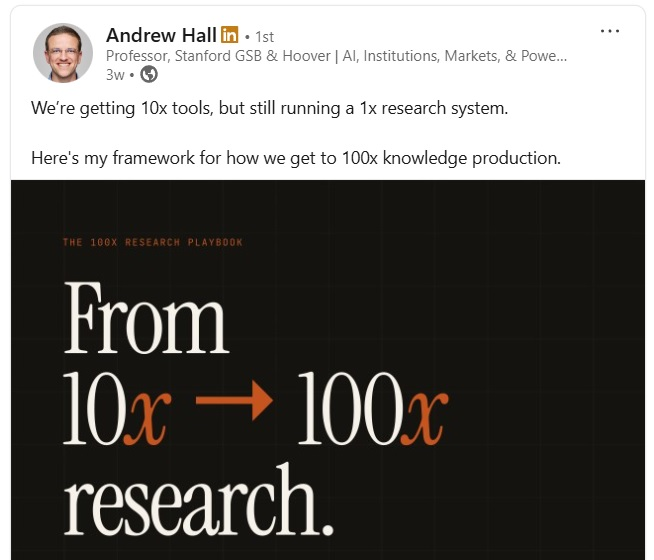
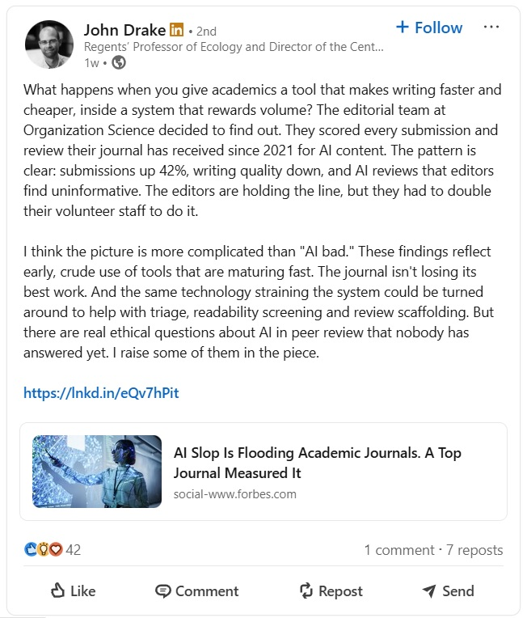
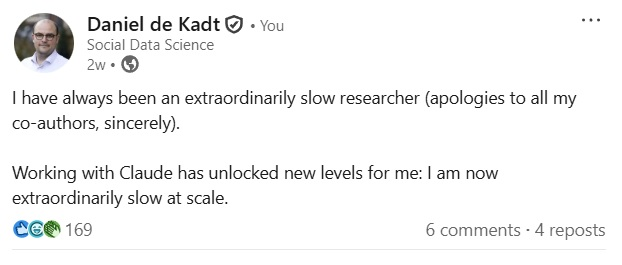
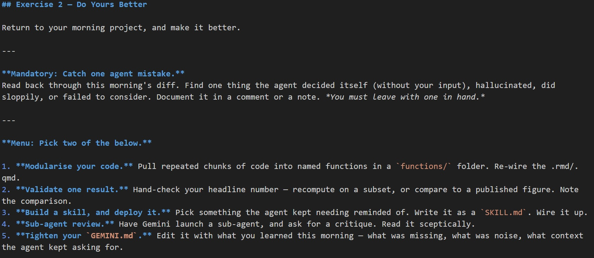

```{r xaringan-themer, include=FALSE, warning=FALSE}
library(xaringanthemer)
style_solarized_light(
  text_font_size = "1.1rem",
  header_h1_font_size = "3rem",
  header_h2_font_size = "1.75rem",
  header_h3_font_size = "1.5rem",
  header_font_google = google_font("Josefin Sans"),
  text_font_google   = google_font("Montserrat", "300", "300i"),
  code_font_google   = google_font("Fira Mono")
)

```

```{r knitr-setup, include = FALSE}
knitr::opts_chunk$set(warning = FALSE, message = FALSE)
```

```{css, echo = FALSE}
.remark-slide-content {
  font-size: 21px;
  padding: 20px 80px 20px 80px;
}
.remark-code, .remark-inline-code {
  background: #f0f0f0;
}
.remark-code {
  font-size: 24px;
}
.huge .remark-code {
  font-size: 200% !important;
}
.tiny .remark-code {
  font-size: 50% !important;
}
.teeny .remark-code {
  font-size: 40% !important;
}

/* Bullet spacing -- a little breathing room between list items */
.remark-slide-content li {
  margin-bottom: 0.5em;
}
.remark-slide-content li li {
  margin-bottom: 0.25em;
}

/* Agent flow diagram */
.flow-diagram {
  display: grid;
  grid-template-columns: auto auto auto auto auto;
  grid-template-rows: auto auto auto;
  align-items: center;
  justify-items: center;
  column-gap: 14px;
  row-gap: 8px;
  margin: 30px 0;
}
.flow-diagram > :nth-child(1) { grid-column: 1; grid-row: 1; }
.flow-diagram > :nth-child(2) { grid-column: 2; grid-row: 1; }
.flow-diagram > :nth-child(3) { grid-column: 3; grid-row: 1; }
.flow-diagram > :nth-child(4) { grid-column: 4; grid-row: 1; }
.flow-diagram > :nth-child(5) { grid-column: 5; grid-row: 1; }
.flow-diagram > :nth-child(6) { grid-column: 3; grid-row: 2; }
.flow-diagram > :nth-child(7) { grid-column: 3; grid-row: 3; }
.flow-node {
  border: 2px solid #586e75;
  border-radius: 8px;
  padding: 12px 18px;
  text-align: center;
  background: #fdf6e3;
  min-width: 110px;
}
.flow-node-harness {
  border-color: #cb4b16;
  border-width: 3px;
  background: #fff;
}
.flow-node-tools {
  border-style: dashed;
  background: #eee8d5;
}
.flow-title {
  font-weight: bold;
}
.flow-sub {
  font-size: 0.7em;
  color: #586e75;
  margin-top: 4px;
  line-height: 1.2;
}
.flow-arrow {
  display: flex;
  flex-direction: column;
  align-items: center;
  font-size: 0.8em;
  white-space: nowrap;
}
.flow-arrow span { line-height: 1.4; }
.flow-note {
  font-size: 0.7em;
  color: #cb4b16;
  font-style: italic;
  margin-top: 2px;
}
.flow-down {
  font-size: 1.5em;
  color: #586e75;
}

/* Dense slides -- for content that would otherwise overrun the slide */
.remark-slide-content.dense { font-size: 19.5px; }
.remark-slide-content.dense li { margin-bottom: 0.3em; }
```


## Welcome Back

**Last week:** the landscape, what agents actually are, and why **context is all you have**. Then you built something with Gemini CLI.

--

**Today:**
- Things you should **fear** (and how to manage them) — we ran out of time last week
- **Doing better, not more**, with agents
- A **live demo** on a real project
- **Responsible practice** — ethics, privacy, security, judgement
- <u>Exercise 2</u>: **Do yours better**

--

Materials are on [GitHub here](https://github.com/ddekadt/cornell-agentic-ai). Fork, clone, or download to follow along.

---

class: center, middle, inverse

# Nothing Is What It Seems

---

class: left, top

## Nothing Is What It Seems

One of the chief dangers of anthropomorphisation is that we impose a human model on the agent. 

--

This means that when the agent...
- Reports something
- Agrees with you
- Tells you it has written something
- Says it is 'reasoning' 
- Proposes an action

... we assume that it is **telling the truth** and **doing what it says**. Or that if it is wrong, it is 'lying' or 'choosing' to be wrong.

--

In reality, you are interacting with a (totally amazing, yes) probabilistic text-production system that is filling in the next token.

---

class: left, top

## Sycophancy and Compliance

Agents are trained to be **helpful** — which usually means agreeing with you and doing what you ask. 

--

**Sycophancy** — the agent agrees with you, especially when you push back:

- `You're right, I apologize` — whether or not its first answer was actually wrong, and how can an LLM apologise? 
- `Good catch, let me revise that` — despite you flagging something that was actually fine

--

**Compliance** — the agent does what you asked, even when what you asked is a bad idea:

- *"Just hard-code that value for now"* — and it's done
- *"Drop those weird rows"* — and they're gone

--

<u>Defence</u>: Push back **with reasons**, and be sceptical of both the agent and yourself. Treat agreement and compliments with suspicion. Have the agent **defend** its first answer before revising it. Launch sub-agents to review.

---

class: left, top

## Confidently Wrong (In Your Research)

You might experience things like:

- `The authors reverse-coded this variable` — no, they didn't
- `The state of the art is X` — no, it's Y
- `It's conventional in the literature to Z` — it totally isn't

--

The model is **not lying**.

--

These are a type of 'hallucination' — the model is 'guessing' (again, anthropomorphisation) but doing so with confidence. 

--

<u>Defence</u>: Ask for sources, and check them. Interrogate presented reasoning. Point the model to resources you trust.

---

class: left, top

## Insidious 'Hallucinations'

One particular type of 'hallucinations' get a lot of press: Made-up citations.

--

These are the tamest 'hallucinations'. They are **obvious** and **easy to catch** and they do basically no damage (beyond your reputation, rightfully so).

--

The **insidious** kind: Incorrect assessments of best practices, misleading summaries of, inferred conventions extrapolated from analogous tools.

--

A true (minor) story from planning this workshop:

> I asked Claude Code to help with my setup files. In a `.gitignore`, it added `GEMINI.local.md` — inferring the convention by analogy with Claude Code's `CLAUDE.local.md`. **No such convention exists.**

--

I only caught it by asking 'have you checked online?' You can easily imagine much worse cases.

--

<u>Defence</u>: Require sources and documentation, verify yourself. Be **sceptical**, both of the agent and yourself. 

---

class: left, top

## Technical Debt

Agents produce code very fast. Faster than you can read carefully.

--

**An analogy**: In the industrial revolution, we knew that mechanised harvesting was a good idea because we got more potatoes harvested per hour, because we could count them. In the AI revolution, how do we know that our potatoes are any good if we can't read them?

--

Common problems:
- Code that runs but the logic is wrong
- Hard-coded parameters that should be global constants
- Taking 'cheat routes' after many failures
- Slightly different ways of doing the same thing scattered across the codebase

--

<u>Defence</u>: Perform spot checks yourself, ask to review diffs, adopt defensive programming, maintenance/review, git.

---

class: left, top

## Cognitive Debt (and Worse)

You stop practising the skills the agent is performing.

--

This is **cognitive debt** — skill atrophy from non-practice. Think about pilots who forget how to fly because of autopilot.

--

A deeper concern: **agent dependence** and **addiction** (I do not use this word lightly). 

--

Fast progress triggers a dopamine response. You might not like going back to being slow. And you might find yourself chasing the next sweet `ggplot` graphic. 

--

<u>Defence</u>: Try to maintain self-awareness? Be **sceptical**, both of the agent and yourself. 

---

class: left, top

## Slop

I've avoided using this term so far, but it's (sadly) unavoidable.

--

LLM-built content is often uninterpretable to humans. This is **AI slop**.

--

LLMs will happily produce slop, and review slop, and approve slop.

--

If you use AI to produce content (slides, a paragraph, some code), actively review and edit it.

--

In my year or so of doing this I don't think AI has ever produced a slide, paragraph, or maybe even a sentence I have been happy with.

--

<u>Defence</u>: Don't be lazy...

---

class: center, middle, inverse

# Do Better, Not More

---

class: left, top

## Do Better, Not More

What you read on LinkedIn/X: Agents make you **faster**! Write more code, run more analyses, submit more papers, profit!

--

For researchers, this should be the **wrong** key performance indicator.

--

There is no shortage of ideas in social science, no shortage of papers, and certainly no shortage of half-finished half-baked projects.

--

What is scarce: **good ideas** and **rigorous execution**.

--

I think the biggest 'winners' will be those who take **good ideas** and **level up their technical execution**. It will not be those who crank out papers at a higher speed.

---

class: center, middle



---

class: center, middle



---

class: center, middle



---

class: center, middle, inverse

# Agentic AI Demo

---

class: center, middle, inverse

# Responsible Agentic Practice

---

class: left, top

## Responsible Agentic Practice

Let's now turn to four topics that are easy to elide: 
- **Professional ethics** — what does your discipline/profession expect of you? 
- **Research ethics** — what should we do with data? 
- **Security and sandboxing** — what can an agent do on your device, and what leaves your machine?
- **Outsourced judgement** — don't let go of the yoke.

---

class: left, top

## Professional Ethics

**Authorship.** If the agent wrote the function or the paragraph — is that *your* work?

--

My view: Yes. Actually, an LLM (or agent) cannot be a scientific author. Humans **are the unit of accountability**. (Disclaimer 1: Not everyone agrees, and I am not important. Disclaimer 2: This does not necessarily apply for homework.)

--

So, you **are accountable for everything you sign your name to.** You initiated it, guided it, reviewed it, read it, understood it, checked it, and are willing to **stake your reputation** on it. 

--

Be prepared to enumerate and defend your use of AI with journals, funders, and employers. This will become more common before it disappears (which it will). Be **honest** about it.

---

class: left, top

## Research Ethics

Anything you paste into a hosted model **leaves your machine.** Storage, retention, and training-use depend on the provider — read the policy, and be sceptical. 

--

Hosted models are a **third party to your data agreements.** Check with your IRB/RERB, but basic guidance:

--

- Sensitive microdata, restricted-access data, interview transcripts? Be very wary.
--

- Public, published, low risk data? Probably fine.
--

- If in doubt... ask your IRB/RERB.

---

class: left, top

## You Are the Training Data

On consumer and free tiers, your conversations are used to train future models **by default**. That is the trade.

--

In May 2026 four Canadian privacy authorities reported on OpenAI. They found that training on user interactions **fell outside users' reasonable expectations**, that safeguards were **not sufficient** to keep sensitive personal information out of the training data, and that express consent should have been sought and was not.

--

That is the largest vendor, under regulatory scrutiny, in a jurisdiction with real privacy law. Assume the others are no better.

---

class: left, top

## Navier–Stokes, September 2026

Tristan Buckmaster (NYU) and Levent Alpöge (Anthropic, acting privately) spent roughly a year working on a series of math problems, working with Claude and Codex. They fed drafts into their Codex sessions throughout.

--

**8 September.** They post a result on three related equations at the same time that OpenAI announces a solution to the full problem, generated by roughly 10,000 agents, 88 hours, millions of dollars in compute, begun on 1 September after staff *"heard a rumor"* that someone at Anthropic had solved a Millenium Prize problem.

--

Buckmaster alleges their drafts became training data, and that he was pressed to drop his co-author for working at Anthropic. 

--

OpenAI's announcement includes this line:

--

> "While unlikely, **we cannot rule out** that de-identified data derived from their usage of our products helped improve our models."

---

class: center, middle


<div style="text-align: center; margin-top: 0.6em; font-size: 0.7em;"><em>Buckmaster's account of the call. Full image at <code>slides/images/buckmaster.jpg</code>.</em></div>

---

class: left, top

## Why This Is Worse For Researchers

A single chat is somewhat scoped, but an **agentic session reads your files** -- reading your files means uploading the text to the LLM endpoint.

--

The packet thus carries unpublished results, participant data, draft manuscripts, grant applications, code that defines your identification strategy — anything that sits in files and folders you allow the agent to read.

--

You are bound by commitments the vendor is not: IRB protocols, data use agreements, NDAs, confidentiality you promised an interviewee, an embargoed manuscript you are refereeing.

--

**Default settings are not a defence.** "I didn't know it was on" will not satisfy your institution, data provider, or co-authors.

--

<u>Practically</u>: find the training toggle on **every service you use**. Keep restricted (or private) data out of any folder you launch an agent in.

---

class: left, top

## Turning It Off

Correct as of **10 September 2026**. All of this moves — check yours.

| | Trained on by default? | Where |
|---|---|---|
| ChatGPT, any consumer plan | **yes** | Settings &rarr; Data Controls |
| Claude, any consumer plan | **yes** | Settings &rarr; Privacy |
| Gemini apps | **yes** | `myactivity.google.com` |
| Gemini API, unpaid | **yes, no opt-out** | upgrade, or avoid |
| API / Business / Enterprise | **no**, contractual | set by contract |

---

class: left, top


## The Toggle Is a Promise, Not a Mechanism

Whether the toggles work cannot be verified from the outside.

--

**Carve-outs survive.** Anthropic's July 2026 policy: conversations flagged for safety review can be used regardless of your setting. T&C can change quickly. 

--

**Retention is not deletion.** Turning training off usually shortens how long companies keep things. It does not change what is already there.

--

Set the toggles but don't mistake them for foolproof protection. **The only full control you have is over what you let the agent see.**

---

class: left, top

## Security & Sandboxing

**Credentials.** Never paste API keys, AWS secrets, database passwords. Do not leave them in files in your project folder. 

--

**Permissions.** Most harnesses have permission systems:
- **Read-only by default** — ask before every write
- **Edit within a folder** — contained to the project
- **Full access** — run any command, touch any file

These don't always work. Be careful.

--

Start narrow. Expand deliberately. The agent does not need to read your `~/Documents` to refactor one R script.

--

For anything you genuinely do not trust — experimental skill packs, code from a random repo, an agent loop you're testing — run it in a **container or VM**.

---

class: left, top

## Don't Let Go of the Yoke

Agentic AI has exploded, and will continue apace. 

--

People (with agentic AI) are regularly releasing 'skill libraries', pre-built `AGENTS.md` files, even 'Agent OS' frameworks.

--

You will be tempted to `git clone` one of these — imagine a 'Causal Inference Made Easy' skill pack with everything your agent needs!

--

When you do this, you are importing someone's **taste**. Their idea of good code, good analysis, good science. 

--

For researchers, that is **scientific taste**. It is the most valuable thing you have.

--

> Do you want to delegate scientific taste to some rando's GitHub account?

--

You are the pilot. Don't let go of the yoke.

---

class: center, middle, inverse

# Wrapping Up

---

class: left, top

## What I Hope You Take Away

1. You are the **pilot**: you are responsible for the work, and accountable for the outcomes. The agent is a tool. 
--

2. **Context** is your lever of control.
--

3. Do better, not more. Use this technology to **level up your execution**. 
--

4. Stay **careful and deliberate**, be **slow at scale**.
--

5. Be **sceptical**
--

6. Be **sceptical**
--

7. Be **sceptical**
--

8. Be **sceptical**
--

9. Be **sceptical**
--

---

class: center, middle, inverse

# Exercise 2: Do Yours Better

Take your project from session 1 and apply today's lessons. Quality, rigour, catch mistakes.

---

class: center, middle, inverse



<div style="text-align: center; margin-top: 0.8em; font-size: 0.7em;"><em>Find this image at <code>slides/images/exercise2.jpg</code> if you need a closer look.</em></div>
